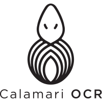
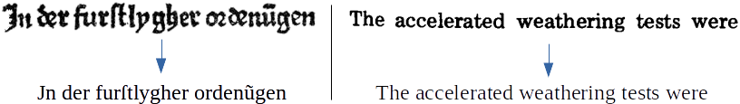

[](https://github.com/Calamari-OCR/calamari/actions/workflows/python-test.yml)
[](https://github.com/Calamari-OCR/calamari/actions/workflows/python-publish.yml)
[](https://github.com/Calamari-OCR/calamari/actions/workflows/black.yml)

OCR Engine based on OCRopy and Kraken using python3.
It is designed to both be easy to use from the command line but also be modular to be integrated and customized from other python scripts.



## Documentation

The documentation of Calamari is hosted [here](https://calamari-ocr.readthedocs.io).

##  Pretrained model repository
Pretrained models are available at (https://github.com/Calamari-OCR/calamari_models).
The current release can be accessed [here](https://github.com/Calamari-OCR/calamari_models/archive/2.0.zip) (255 MB).

## Installing

Calamari is available on [pypi](https://pypi.org/project/calamari-ocr):

```shell
pip install calamari-ocr
```

Read the [docs](https://calamari-ocr.readthedocs.io) for further instructions.

## Command-Line Interface

See the [docs](https://calamari-ocr.readthedocs.io) to learn how to use Calamari from the command line.

## Calamari API

See the [docs](https://calamari-ocr.readthedocs.io) to learn how to adapt Calamari for your needs.

## Citing Calamari

If you use Calamari in your Research-Project, please cite:

> Wick, C., Reul, C., Puppe, F.: *Calamari - A High-Performance Tensorflow-based Deep Learning Package for Optical Character Recognition.* Digital Humanities Quarterly **14**(1) (2020)

```
@article{wick_calamari_2020,
    title = {Calamari - {A} {High}-{Performance} {Tensorflow}-based {Deep} {Learning} {Package} for {Optical} {Character} {Recognition}},
    volume = {14},
    number = {1},
    journal = {Digital Humanities Quarterly},
    author = {Wick, Christoph and Reul, Christian and Puppe, Frank},
    year = {2020},
}
```
